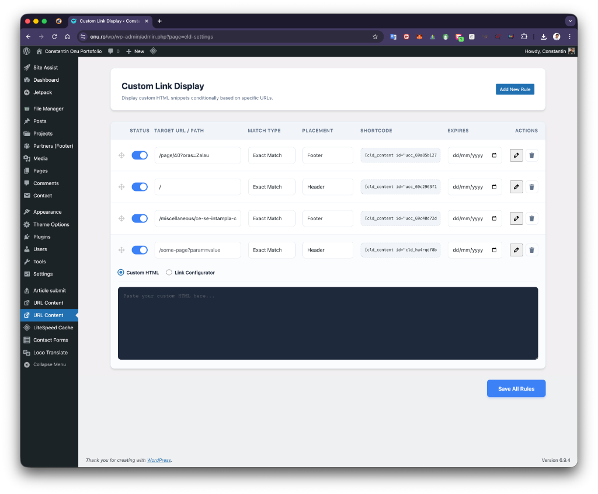
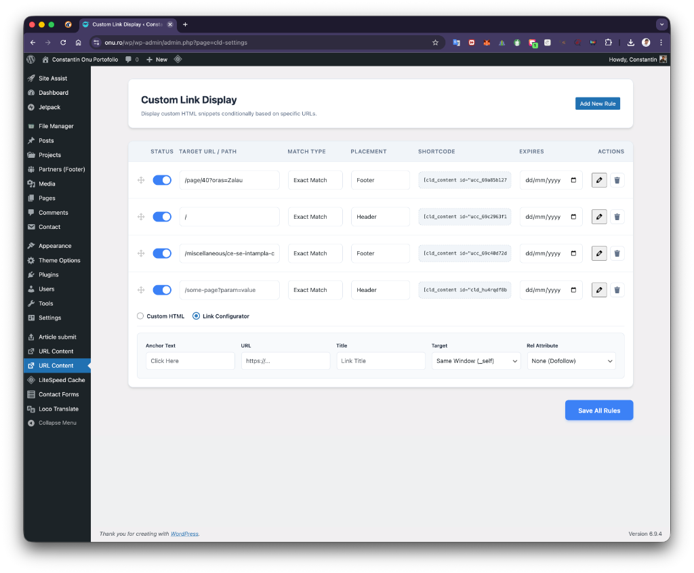

# Custom Link Display Plugin for WordPress

**Custom Link Display** is a flexible and lightweight WordPress plugin that lets you selectively inject custom HTML snippets or dynamically configured links onto specific pages, precisely based on their URLs or URL query parameters.

## ✨ Features

* **Target Specific URLs:** Show custom content only on specific pages. Match URLs strictly, by keyword using "Contains", or via **RegEx Patterns**.
* **Query Parameter Support:** Powerful rule engine easily targets dynamic URLs containing specific parameters (e.g., `example.com/page?campaign=summer`).
* **Mutually Exclusive Content Types:** Choose to either inject a raw custom HTML block or use the visual Link Configurator to build smart anchor tags without touching code.
* **Flexible Placements:** Automatically inject rules into the Header, Footer, Before Content, or After Content.
* **Shortcode Support:** Use `[cld_content id="..."]` to manually output your conditional content exactly where you want it within page builders or the Block Editor.
* **Expiry Dates:** Automatically turn off a conditional rule after a specified date.
* **Visual Rule Ordering:** Simple drag-and-drop rule reordering ensures the correct cascade of priority.
* **Premium Admin UI:** Minimalist, fast, and entirely built with a polished native look in the WordPress dashboard.

## 📸 Screenshots

| Custom HTML Mode | Link Configurator Mode |
|---|---|
|  |  |

## 🚀 Installation

### Option 1: WordPress Dashboard

1. Go to **Plugins > Add New** in your WordPress admin dashboard.
2. Click **Upload Plugin** at the top of the screen.
3. Choose the `custom-link-display.zip` file and click **Install Now**.
4. Click **Activate Plugin** once the installation is complete.

### Option 2: Manual FTP Upload

1. Download and extract the `custom-link-display.zip` archive.
2. Upload the unzipped `custom-link-display` folder to your website's `/wp-content/plugins/` directory.
3. Log into your WordPress dashboard, navigate to the **Plugins** screen, and click **Activate** under "Custom Link Display".

## 📖 Usage Guide

Once activated, you will find a new menu item called **URL Content** in your WordPress admin sidebar.

### Creating a New Rule

1. Click the **"Add New Rule"** button. This will append a new configuration block.
2. Toggle the **Status** to activate the rule.
3. Fill in the **Target URL / Path**. You can use a full URL or just a local path like `/contact-us/`.
4. Choose the **Match Type**:
   * **Exact Match:** The user's URL must perfectly match your target.
   * **Contains:** Triggers if the target string is found anywhere in the current URL (great for query parameters).
   * **Regex Match:** Triggers if the URL matches standard PCRE Regular Expressions.
5. Select a **Placement** (Header, Footer, Before Content, After Content, or Shortcode Only).
6. Pick an **Expiry Date** if the content is time-sensitive (optional).

### Content Types: Custom HTML vs. Link Configurator

By clicking the **Edit Content** button (the pencil icon) in the Actions column, you can define exactly what gets injected. You can toggle between two modes using the radio buttons above the text area:

* **Custom HTML:** Provides a raw text area where you can inject fully formatted `<script>`, `<style>`, `
`, or pixel codes perfectly tailored to this condition.
* **Link Configurator:** Gives you visual inputs for **Anchor Text, URL, Title, Target (`_self` vs `_blank`), and Rel arguments (nofollow, sponsored, etc.)**. The plugin will automatically compile a clean, SEO-friendly HTML link and output it.

### Shortcode Integration

Are you using Elementor, Divi, or Gutenberg? Every rule automatically generates a unique tracking shortcode.

1. If you just want to output the rule inside a specific widget box, set the rule's placement to **Shortcode Only**.
2. Click the shortcode string in the dashboard (e.g. `[cld_content id="cld_12345"]`) — it will auto-copy to your clipboard.
3. Paste the shortcode anywhere on your site. The content will only display if the URL matches the rule configuration!
